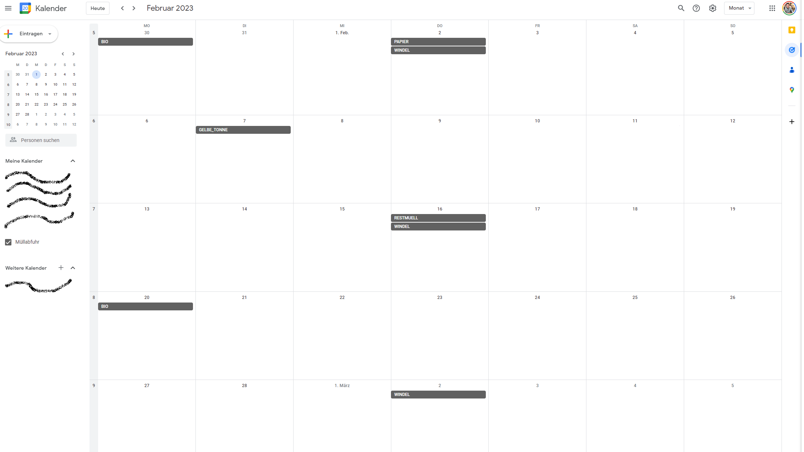

# GVA (Gemeindeverband für Abfallbeseitigung) Abholtermin-Exporter

Lädt die Seite des "Gemeindeverband für Abfallbeseitigung" und exportiert die Abholtermin Daten in ein Google Kalender kompatibles Format.

## Download

Letzte Version für 2023:
https://github.com/mfischelmayer/gva-abholtermin-exporter/releases/download/1.1.0/gva-1.1.0.jar

## Benutzung

### Parameter

`-- url` Die URL der GVA Zielseite (z.b. https://tulln.umweltverbaende.at/?gem_nr=32120&jahr=2022&portal=verband&vb=tu&kat=32)

`-- file` Der Pfad für die Export-Datei

`-- filter` (optional) Wortfilter für Inhalte welche nicht benötigt werden (Mehrfachnennung möglich)

#### Beispiel:
````
java -jar gva.jar --url https://tulln.umweltverbaende.at/?gem_nr=32120&jahr=2022&portal=verband&vb=tu&kat=32 --file C:\tmp\exportgoogle.csv --filter "Haushalte 2" --filter "Wohnhausanlagen"
````

### Importieren bei Google

(Siehe auch https://support.google.com/calendar/answer/37118?hl=en&co=GENIE.Platform%3DDesktop)

* Google Calendar öffnen (https://www.google.com/calendar)
* Rechts oben auf "Einstellungen" klicken (Zahnrad)
* Menüpunkt "Importieren & Exportieren" öffnen
* Datei in den gewünschten Kalender importieren 


